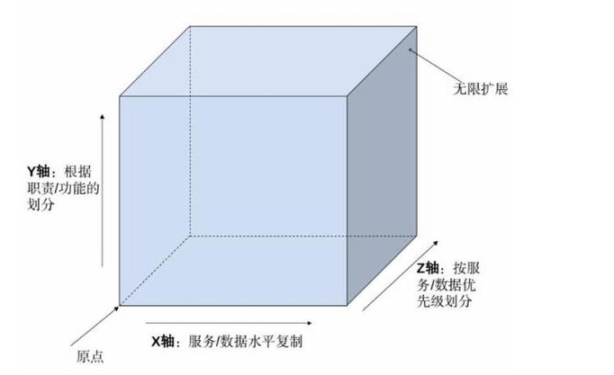

# 架构真经：互联网技术架构的设计原则

## 主旨

这本书的英文名是scalability rules，但这里的scalability比狭义的可扩展性含义更广泛，不止是架构上，也涉及到工程、团队等方面的经验总结。

## 50条可扩展性规则

* 规则1 避免过度设计

产品的设计超出设计需求、完成的产品对于用户过度复杂、技术实现复杂到令他人难以理解都是过度设计的表现。复杂的系统实施成本高、维护困难，简单的系统容易扩展、可维护性强且成本低。

* 规则2 方案中包括扩展

在早期考虑到容量扩展的需求，但借助IaaS等服务可以在容量临近所需时再按需扩展。

* 规则3 三次简化方案

从方案的范围、设计和实施角度进行简化。

* 规则4 减少域名解析

对于性能敏感的网页，减少下载页面所需的域名解析次数。

* 规则5 减少页面目标

对于性能敏感的网页，减少网页上的对象数量和尽可能缩小对象大小。

* 规则6 采用同构网络

对于路由器和交换机，确保使用同一供应商的产品，可以减少可用性和可扩展性方面的问题。

* 规则7 X轴扩展

AKF立方体中的X轴扩展，即水平扩展。通过复制服务或者数据库以分散事务负载。研发成本低，适用于业务发展初期，业务复杂度低，需要增加系统容量的场景。

* 规则8 Y轴拆分

AKF立方体中的Y轴扩展，将服务和数据按照动词/名词定义的边界进行拆分。研发成本中，适用于业务逐渐复杂，数据量逐渐增大，代码耦合度变高，团队规模较大时的场景。

* 规则9 Z轴拆分

AKF立方体中的Z轴扩展，即分片。将数据或者服务按照用户属性进行拆分。研发成本高，适用于用户数量按指数级快速增长的场景。

* 规则10 向外扩展

向外扩展（Scale Out）而不是向上扩展（Scale Up），使技术资源投入的成本随着业务复杂度而线性增加。

* 规则11 用商品化系统

商品化系统是指成本低廉的小型机而不是规格巨大的大型机。单机规格越大，性价比就越低，投资成本越大。廉价的小型机意味着可随时被替换，并适合将来业务高速扩张时进行扩展。

* 规则12 托管方案扩展

使用多活数据中心来降低数据中心的总体成本、增强可用性和实现异地灾备。N（N≥3）个数据中心的解决方案与两数据中心相比总体成本更低。只要保证N-1个数据中心的可用性，就可保证数据和功能不受影响。

* 规则13 利用云

利用云的弹性和敏捷性应对临时需求，可实现在短时间内按需扩展。

* 规则14 适当使用数据库

考虑数据量、数据关系、一致性、灵活性、可扩展性等因素，在关系型数据库、NoSQL、文件系统之间进行取舍。

* 规则15 慎重使用防火墙

防火墙容易成为可扩展性的瓶颈，要慎重使用，对于不同类型的数据选用不同的安全等级和风险防范工具。

* 规则16 积极使用日志文件

充分利用日志文件帮助定位生产问题。通过Splunk或ELK等工具可以帮助对日志进行聚合和监控。

* 规则17 避免画蛇添足

避免对刚刚写入的数据进行读取验证，可以通过对写操作的返回码验证写入是否正确。

* 规则18 停止重定向

如有可能尽量避免重定向，因为其消耗计算资源、延迟用户交互过程、增加出错概率并对搜索引擎不利。如必须重定向，可使用服务器配置而非html页面或脚本代码。

* 规则19 放宽时间约束

因为关系型数据库的ACID属性，保持高可用和强一致是较为困难的，不妨放宽时间约束，使用最终一致性，允许短时间内的不一致。

* 规则20 利用CDN缓存

CDN是一组边缘节点或服务器，用于缓存用户的页面内容和数据，可以是静态文件或动态数据。CDN的实施也有成本，按流量收费，所以通常大中型客户才能利用CDN获得收益。

* 规则21 灵活管理缓存

使用http header中的cache-control、keep-alives等启用缓存和持续连接，提高性能。

* 规则22 利用Ajax缓存

通过http header控制Ajax接口也可以利用缓存。

* 规则23 利用页面缓存

服务器前部署页面缓存，并使用E-tag等http header。

* 规则24 利用应用缓存

分析如何拆分架构，并最大化应用缓存效果。

* 规则25 利用对象缓存

在数据库和应用层之间建立对象缓存。

* 规则26 独立对象缓存

在架构中使用单独的对象缓存层并挪到自己的服务器上。

* 规则27 失败乃成功之母

千万不要浪费失败的机会，抓紧每个机会学习，发现架构、人和过程中的问题。

* 规则28 不靠QA发现错误

系统质量无法测试，QA只能发现过去所犯的错误，应当通过内建质量来减少返工机会。

* 规则29 不能回滚注定失败

稳健的飞行员不会在飞机不能着陆时起飞，明智的工程师不会在代码不能紧急回滚时发布。

* 规则30 从事务处理中清除商务智能

例如把存储过程的逻辑从数据库移到应用中，让系统更容易测试和扩展。

* 规则31 注意昂贵的关系

设计数据模型时，考虑数据库分离和未来可能的数据扩展需求。

* 规则32 正确使用数据库锁

正确选择和使用数据库锁，以便最大化系统的并发性。

* 规则33 禁用分阶段提交

2PC之类的分阶段提交协议实际上是一个阻塞式协议，会阻塞其它事务完成，因此尽可能避免使用分阶段提交协议来延长单体数据库的寿命，不利于系统扩展。

* 规则34 慎用Select for Update

慎用行锁，可能减缓事务处理速度。

* 规则35 避免选择所有列

避免在select或insert语句中使用语意不清的通配符，因为会浪费传输资源、可能出问题或者影响回滚。

* 规则36 用“泳道”隔离故障

通过物理或者逻辑上分隔的“泳道”来隔离故障。

* 规则37 拒绝单点故障

在架构图上寻找单实例，尽可能将其配置成主动/主动模式。

* 规则38 避免系统串联

受多重失败乘法效应的影响，每增加一个串联组件就会使回路的可用性降低。应该尽量减少串联组件和增加并联组件。

* 规则39 启用与禁用功能

采用类似断路器这样的上线/下线框架，来关闭非关键的功能，以保证对用户重要关键的功能。

* 规则40 力求无状态

状态会限制系统的可扩展性，消耗资源和成本，降低系统单位时间内可服务用户的数量。在设计系统时反复拷问是否确实需要状态，力求无状态，如确有必要保持状态则参考规则41和规则42。

* 规则41 在浏览器中保存会话数据

建议将会话数据保存在用户cookie中，可以减少系统查询会话数据的负担并容易水平扩展。但要尽量控制cookie的大小，以避免降低页面加载速度。另外，可通过https传输防止cookie被劫持。

* 规则42 用分布式缓存处理状态

对于需要存储会话数据但又不能在浏览器上存储的场景，可以使用分布式缓存来存储会话数据，相对于数据库方案成本更低廉且容易扩展。

* 规则43 尽可能异步通信

同步通信的调用方需要等待，可能会导致系统连锁性故障，因此尽可能地使用异步通信。

* 规则44 扩展消息总线

消息总线本身也需要扩展，考虑按AKF立方体中的Y轴或Z轴扩展比较适合。

* 规则45 避免总线过度拥挤

消息总线上不需要发布一切消息，以价值和成本综合衡量发布何种消息。

* 规则46 警惕第三方方案

使用本书中所阐述的规则来扩展系统，不要依赖第三方方案，以便控制额外的复杂性和成本。

* 规则47 梯级存储策略

使用多样的存储方案，根据数据价值的不同，使用与之匹配的存储。

* 规则48 分类处理不同负载

将工作负载分为归纳、演绎、批处理、用户交互四种不同类型，各种类型均有不同的性能和可用性要求，需要放置在不同的故障隔离区。

* 规则49 完善监控

在系统中适当的埋点以记录事务的时间，把必须监控作为一条架构原则，以在故障发生时回答许多问题。

* 规则50 保持竞争力

对于系统中的每个组件都要足够了解并保持有竞争力的解决方案。